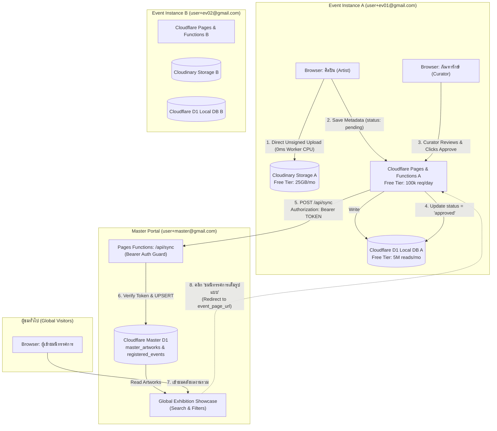
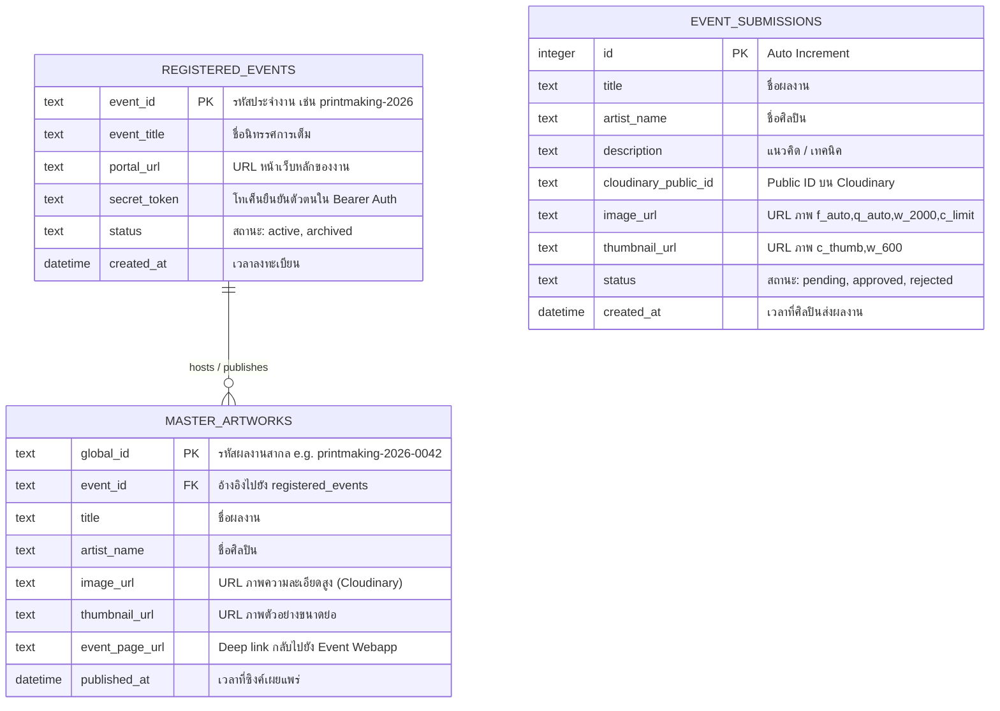
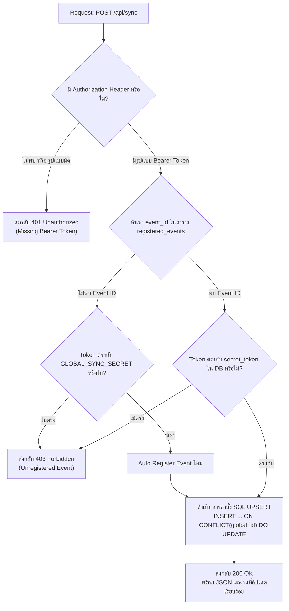

# ผังการเชื่อมต่อระบบ (System Architecture & Integration Flow)
## Multi-Tenant Virtual Exhibition System (Zero-Budget Architecture)

เอกสารนี้แสดงผังการเชื่อมต่อสถาปัตยกรรมระบบ การไหลของข้อมูล (Data Flow) ความสัมพันธ์ของฐานข้อมูล และกลไกความปลอดภัยของ Webhook ระหว่าง **Event Webapps** และ **Master Portal**

---

## 1. ผังโครงสร้างระบบและการแยกบัญชี (Account Isolation Architecture)

แต่ละงานนิทรรศการ (Event) จะแยกบัญชี **Cloudflare + Cloudinary** โดยสิ้นเชิงเพื่อไม่ให้ติดโควตา Free Tier โดยมี Master Portal เป็นศูนย์รวมกลาง

---

## 2. ลำดับขั้นตอนการทำงานแบบละเอียด (End-to-End Sequence Diagram)

```mermaid
sequenceDiagram
    autonumber
    actor Artist as ศิลปิน (Artist)
    participant Browser as Browser Client
    participant Cloudinary as Cloudinary API
    participant EventWorker as Event Pages Function
    participant EventD1 as Event D1 Database
    actor Curator as ภัณฑารักษ์ (Curator)
    participant MasterWorker as Master /api/sync
    participant MasterD1 as Master D1 Database
    actor Visitor as ผู้ชมทั่วไป (Visitor)

    %% Step 1: Artist Submission
    rect rgb(20, 30, 50)
    Note over Artist, EventD1: ขั้นตอนที่ 1: การส่งผลงานของศิลปิน
    Artist->>Browser: เลือกไฟล์รูปภาพ & กรอกข้อมูลผลงาน
    Browser->>Cloudinary: POST /image/upload (Direct Unsigned Preset)
    Cloudinary-->>Browser: ส่งกลับ public_id, image_url, thumbnail_url
    Browser->>EventWorker: POST /api/submissions (แนบ URLs + Metadata)
    EventWorker->>EventD1: INSERT INTO submissions (status = 'pending')
    EventD1-->>EventWorker: สำเร็จ (ID = 42)
    EventWorker-->>Browser: 201 Created (รหัสผลงาน #42)
    Browser-->>Artist: แสดงกล่องยืนยันการส่งผลงาน
    end

    %% Step 2: Curation & Webhook Trigger
    rect rgb(30, 40, 20)
    Note over Curator, MasterD1: ขั้นตอนที่ 2: ตรวจรับผลงาน & Push Webhook
    Curator->>Browser: ตรวจสอบผลงานใน Admin Dashboard
    Curator->>Browser: กดปุ่ม "อนุมัติ & Push Webhook"
    Browser->>EventWorker: POST /api/submissions/42/approve (x-admin-key)
    EventWorker->>EventD1: UPDATE submissions SET status = 'approved' WHERE id = 42
    
    EventWorker->>MasterWorker: POST /api/sync<br/>Header: Authorization: Bearer SECRET_TOKEN<br/>Payload: {event_id, global_id, title, artist, image_url, event_page_url}
    
    MasterWorker->>MasterD1: ตรวจสอบ Token กับตาราง registered_events
    alt Token ถูกต้อง
        MasterWorker->>MasterD1: UPSERT INTO master_artworks
        MasterD1-->>MasterWorker: บันทึกสำเร็จ
        MasterWorker-->>EventWorker: 200 OK (Sync Successful)
    else Token ไม่ถูกต้อง
        MasterWorker-->>EventWorker: 401 / 403 (Unauthorized / Forbidden)
    end
    EventWorker-->>Browser: แจ้งสถานะการอนุมัติและผลลัพธ์ Webhook
    end

    %% Step 3: Global Discovery & Deep Link
    rect rgb(40, 20, 40)
    Note over Visitor, EventWorker: ขั้นตอนที่ 3: การรับชมและการเชื่อมโยงกลับ (Deep Linking)
    Visitor->>MasterWorker: เข้าชม Master Portal (GET /api/artworks)
    MasterWorker->>MasterD1: ดึงผลงานรวมทุก Event
    MasterWorker-->>Visitor: แสดงการ์ดผลงานใน Global Gallery
    Visitor->>Browser: คลิกปุ่ม "ชมนิทรรศการเต็มรูปแบบ"
    Browser->>EventWorker: Redirect ไปยัง event_page_url (เช่น /artwork.html?id=42)
    EventWorker-->>Visitor: เปิดหน้าชมผลงานความละเอียดสูงในเว็บเฉพาะของงานนั้น
    end
```

---

## 3. ผังความสัมพันธ์ข้อมูล (Entity Relationship Diagram)

---

## 4. แผนผังความปลอดภัยและการตรวจสอบสิทธิ์ Webhook (Security Flowchart)

---

## 5. จุดเด่นของการออกแบบ Zero-Budget
1. **0 CPU Overhead บน Worker ตอนอัปโหลด:** อาศัย Direct Unsigned Upload ของ Cloudinary จาก Browser โดยตรง
2. **ไม่ติดเพดาน Free Tier (Bandwidth / Quota):** แยก 1 งาน = 1 บัญชี Cloudflare (100,000 req/วัน) + 1 บัญชี Cloudinary (25GB/เดือน)
3. **โครงสร้างทนต่อข้อผิดพลาด (Idempotent Webhook):** ใช้คำสั่ง `ON CONFLICT(global_id) DO UPDATE` ทำให้หากส่ง Webhook ซ้ำจะไม่เกิดข้อมูลเบิ้ลหรือ Error
4. **ความปลอดภัยสูง:** ทุก Event เชื่อมต่อผ่าน Bearer Token ที่ถูกตรวจสอบกับ Master D1 เสมอ
